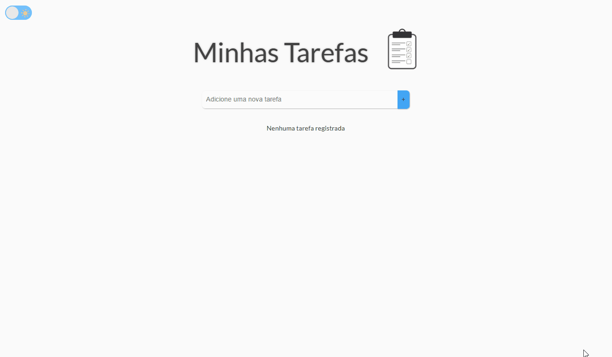

<div align="center">
  
</div>

<h1 align="center" fontSize="60px">
 TodoList - Vue
</h1>

<div align="center">
<h3>Layout</h3>
  
</div>

## 💻 Projeto

O propósito da aplicação dessa aplicação desenvolvida com Vue.js é
 focada em proporcionar uma gestão de tarefas prática e intuitiva. A interface oferece uma série de funcionalidades essenciais para uma experiência de usuário fluida e eficiente.
 

#### Para ver o projeto pronto [clique aqui](https://clari-cassia-projetcs-pokedex.vercel.app/)🚀

## ⚙️Funcionalidades
📝 Adicionar Tarefa: Permite adicionar novas tarefas com validação que evita a criação de tarefas vazias ou duplicadas.

 🔄 Filtros de Seleção: Agora, os usuários podem filtrar e selecionar tarefas por status, como "Todas", "Pendentes" ou "Concluídas", facilitando o gerenciamento de grandes listas de tarefas.

 📊 Barra de Progresso: Exibe a porcentagem de tarefas concluídas de forma visual, com a cor da barra ajustando-se conforme o progresso.

👁️ Visualização das Tarefas: As tarefas aparecem em vermelho, destacando as pendentes. Ao clicar no cheked de uma tarefa, ela é marcada como concluída, mudando para verde. O status da tarefa pode ser alterado a qualquer momento, facilitando a visualização das tarefas a serem feitas e das já finalizadas.

🗑️ Excluir Tarefa: Cada tarefa tem um botão de exclusão, permitindo a remoção de tarefas individualmente.

🚮 Excluir Todas as Tarefas: O botão de lixeira permite excluir todas as tarefas de uma vez, com um alerta de confirmação para evitar exclusões acidentais.

💾 Armazenamento Local: As tarefas são salvas localmente no navegador usando localStorage, garantindo que os dados persistam entre sessões, mesmo após recarregar a página.

📱 Responsividade: A aplicação é projetada para se adaptar a diferentes tamanhos de tela, proporcionando uma experiência otimizada em dispositivos móveis, tablets e desktops.

## 🛠️ Ferramentas Utilizadas

- [Vue 3](https://vuejs.org/)
- [Nuxt 3](https://nuxt.com/docs)
- [Pinia](https://pinia.vuejs.org/)


## 👣 Passo a Passo para a Criação do Desafio

No link abaixo você encontra um documento que contém todos os detalhes necessários para o desenvolvimento desse projeto. Ele inclui os requisitos obrigatórios e diferenciais, instruções de funcionalidades mínimas, estruturação do projeto que foi usada, fluxos da aplicação, além das tecnologias a serem estudadas e passos para a implementação. 

#### Para ver o documento [clique aqui](https://coral-phalange-295.notion.site/Desafio-T-cnico-To-Do-List-Implementa-o-com-Vue-3-e-Nuxt-3-19a9461fda09807bba56e0d6c232c73a)🚀


## 🧠 Decisões Adotadas

### Tomada de Decisão

Durante o desenvolvimento deste projeto, houve decisões baseadas nas melhores práticas de desenvolvimento, visando garantir a funcionalidade, legibilidade e manutenção do código. Abaixo estão algumas das principais escolhas que fiz:

1. **Uso do  Nuxt com Vue 3**: Como o projeto requer o uso do Nuxt.js, optei por utilizar este framework para construir a aplicação SSR (Server-Side Rendered) com Vue 3. O Nuxt oferece uma excelente estrutura para organizar o projeto, facilita a criação de páginas dinâmicas e melhora a performance com a renderização do lado servidor. Ele também simplifica o roteamento e a organização dos arquivos, permitindo um desenvolvimento mais rápido e com menos configuração.

2. **Uso do Vue.js com Composition API**: Optei por usar a Composition API do Vue.js para gerenciar o estado e a lógica do componente, pois ela oferece uma maneira mais flexível e escalável de organizar o código, especialmente para projetos maiores. Isso facilita a reutilização de lógica entre os componentes e melhora a legibilidade do código.

3. **Gerenciamento de Estado Global com Pinia**: Para o gerenciamento de tarefas, utilizei o Pinia como gerenciador de estado global. O Pinia foi escolhido por ser uma solução moderna, eficiente e recomendada para o Vue 3, com uma API simples e clara que facilita o fluxo de dados e o gerenciamento das tarefas entre os componentes. Além disso, ele oferece uma integração nativa com o Vue 3, garantindo desempenho otimizado e fácil manutenção do estado global da aplicação

4. **Validação de Entrada no Componente**: Implementar a validação de entrada diretamente no componente de criação de tarefas foi uma escolha estratégica para evitar dados inválidos, como nomes vazios ou duplicados. Essa validação é feita antes de adicionar a tarefa à lista, garantindo uma boa experiência do usuário e a integridade dos dados.

5. **Utilização de Ciclos de Vida**: Aproveitei o ciclo de vida do Vue.js, especificamente os hooks `onMounted` e `onBeforeUnmount`, para garantir que o foco seja colocado corretamente no campo de entrada quando o componente for carregado, além de limpar os erros antes do componente ser desmontado. Isso melhora a experiência do usuário ao interagir com o formulário de criação de tarefas.

6. **Armazenamento Local com `localStorage`**: Para persistir as tarefas entre as sessões, optei por usar o `localStorage`. Isso permite que as tarefas sejam mantidas mesmo quando o usuário fecha ou recarrega a página. Como a aplicação não requer um backend no momento, essa solução foi suficiente para garantir a persistência local dos dados.

7. **Uso de Estilos e Responsividade**: Para garantir uma boa experiência de uso em dispositivos móveis e desktop, adotei práticas de design responsivo, ajustando a largura dos inputs e botões conforme o tamanho da tela. Isso melhora a usabilidade em dispositivos móveis e garante que o layout seja acessível em diferentes tamanhos de tela.

Essas decisões foram tomadas com o objetivo de criar uma aplicação eficiente, escalável e fácil de manter, levando em consideração as boas práticas de desenvolvimento e a experiência do usuário.


## 📥 Passo a Passo  para instalação e execução

 **Pré-requisitos:**

- Vs Code
- Node.js instalado 
- Terminal / Git Bash - Ferramenta de versionamento
- Npm ou Yarn - Controle de pacotes

 **1. Clone o Repositório:**
   Dentro da pasta onde deseja salvar o projeto, abra o git e efetuar o comando

   ```bash
   git clone https://github.com/ClariCassia/todoList-vue-Eslab.git
   
   ```

- É possível também baixar o arquivo e desconpactar localmente:
- 

 **2. Acesse o Diretório:**

   ```bash
   cd nome-do-projeto
   ```

 **3. Instale as Dependências:**

   ```bash
   npm install   # ou yarn install, conforme sua prefêrencia
   ```

 **4. Execute a Aplicação:**

   ```bash
   npm run dev  
     # ou yarn run dev
   ```

 **5. Acesse a Aplicação:**
   Abra o navegador e acesse [http://localhost:5173/](http://localhost:5173/).

## 🤝 Contribuições

Se quiser contribuir para este projeto, siga estes passos:

Faça o `fork` e clone o projeto a partir do seu usuário.

```bash
# Clonando projeto
$ git clone https://github.com/SEU-NOME-DE-USUARIO/pokedex.git

# Criando um branch
$ git branch minha-alteracao

# Acessando o novo branch
$ git checkout -b minha-alteracao

# Adicionando os arquivos alterados
$ git add .

# Criando commit e a mensagem
$ git commit -m "Add nova funcionalidade"

# Enviando alterações para o brach
$ git push origin minha-alteracao
```

Você deve navegar até o seu repositório onde fez o fork e clicar no botão *New pull request* no lado esquerdo da página.

Agradeço antecipadamente pela sua contribuição, juntos podemos tornar este projeto ainda mais incrível! 🙏🌟

Com ❤️ por [Clarissa de Cássia](https://www.linkedin.com/in/clarissa-cassia-dev-front-end/) 😊

